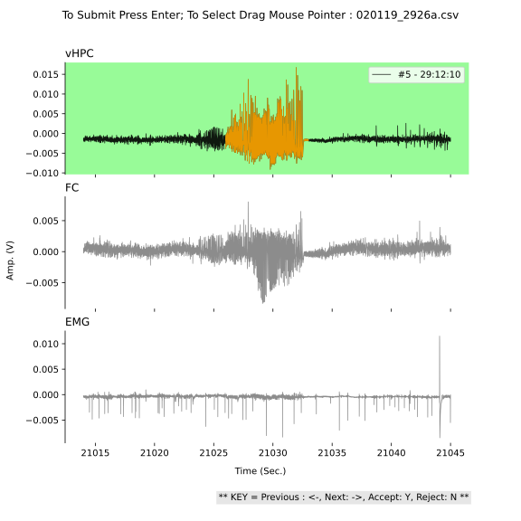

# deep-seizure-detect
Offline semi-automated seizure detection using deep learning

---
## How to install
1) Download and install [miniconda](https://docs.conda.io/en/latest/miniconda.html) on your platform
2) Clone or Download [deep-seizure-detect](https://github.com/pantelisantonoudiou/deep-seizure-detect)
3) Start Anaconda powershell prompt, navigate to */deep-seizure-detect*:

        # create conda environment with python version 3.7.7
        conda create --name myenv python=3.7.7     
        
        # enter conda environment
        conda activate myenv
        
        # install dependencies
        conda install -c anaconda keras
        conda install -c anaconda scikit-learn
        conda install -c anaconda matplotlib
        conda install -c anaconda seaborn
        conda install -c anaconda numba
        conda install -c anaconda tqdm
        pip install tables
        pip install pick
        
        # optional for gpu usage
        conda install tensorflow-gpu
        
---
## How to use

Start Anaconda powershell prompt
        
        # navigate to *deep-seizure-detect* folder
        cd ./deep-seizure-detect

        # enter conda environment
        conda activate myenv

        # Get path of the folder containing reorganized_data subfolder with data to generate predictions       
        python get_path.py
        
        # generate predictions
        python batch_predict.py
        
        # verify seizures
        python app.py
        

        
        
        
        
        
        
        
        
        
        
        
