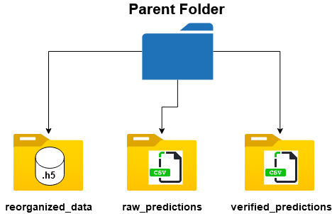

## Configuration settings

    - main_path : path to parent folder, e.g. "C:\\Users\\...\\parent folder"
    - org_rawpath : child folder name where .h5 data present, default is "reorganized_data"
    - rawpred_path : child folder name where raw predictions are present (.csv), default is "raw_predictions"
    - verpred_path : child folder name where user verified predictions are present (.csv), default is "verified_predictions" 
    - ch_struct : List containing the names of LFP/EEG channels, e.g. ["vhpc", "pfc", "emg"]
    - ch_list : Selected channel to run predictions, Default is [0] -> "vhpc", e.g. [1]-> "pfc"
    - win : window size in seconds, for the current models needs to be 5
    - fs : sampling rate of .h5 files, for the current models needs to be 100
    - model_path : path to model that will generate predictions, set as -> "models\\cnn1D_3layer.h5"
---
## Path organization

---

## Data Format

The data have to be converted to .h5 files with 3 dimensions.

1D = segments, 2D = time points (has to be 500 = 5 seconds * 100 samples per seconds), 3d = channels

*e.g. for ch_struct: ["vhpc", "pfc", "emg"] -> data = (1000, 500, 3)*

**[<< Back to Main Page](/README.md)**
